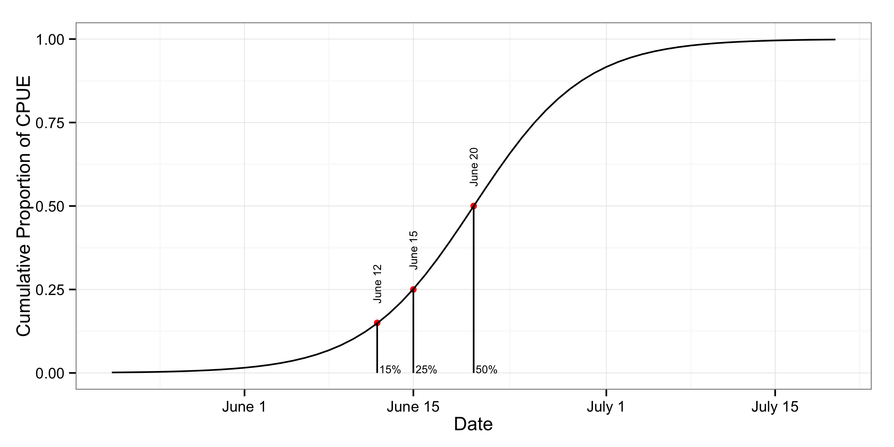

---
output:
  pdf_document: default
  html_document:
    keep_md: yes
---

```{r, echo = FALSE}
library(knitr)
```

# 2015 April Forecast Writeup

-------   | ------ 
Author    | Bryce Mecum (bdmecum@alaska.edu) 
Written   | 2015-05-03 
Generated | `r Sys.Date()`

## Model & Data

The model used in this analysis was a modified version of the full model from
Mundy & Evenson (2011), where the full model regresses three environmental variables against three percentiles of cumulative catch-per-unit-effort (CPUE) from a time series of D-1 Yukon commercial fishing catch data (1961-1979) and test fishing catches from the Lower Yukon Test Fishery (LYTF, 1980-2014). 

The reduced model was comprised of just one of the three explanatory variables, April mean air temperature at Nome, Alaska (AMATC), and was used to predict three percentiles of cumulative CPUE. I used this reduced model because AMATC for the current forecast year is available at the end of April while data for the other two variables is not avaialble until the end of May for the current
forecast year.

While the relationship between the three percentiles of cumulative CPUE is better explained by all three environmental variables, managers and other interested stakeholders have interest in seeing a preliminary forecast available earlier than at the end of May.

Below is a pair scatterplot for the three percentiles and AMATC:


## Historical performance

To arrive at an estimate of expected out-of-sample forecast error, I used hindcasting to calculate a suite of forecast error metrics. Here, hindcasting refers to the process of making a forecast from a model for year $y$ after the model has been fit to data collected prior to year $y$. The suite of forecast error metrics were (1) mean absolute prediction error (MAPE), (2) average width of the approximate 95% normal confidence interval for each prediction (INTWIDTH), and the proportion of observations within the prediction interval (PROPIN).

The years the hindcast was performed over were 1990 - 2014.

```{r kable, echo=FALSE}
metrics <- read.csv("../output/hindcast_metrics.csv")
kable(metrics[,-1])
```

The following graphic shows the observed (black) and predicted (red) values for the three percentiles of cumulative CPUE with the approximate 95% confidence interval shown as a red ribbon.


## 2015 Forecast

Using a 2015 value for AMATC of -5.88889 $^\circ$C, the dates of the three percentiles of CPUE are June 12, 15, and 20 (15%, 25%, 50%). These values were created by fitting the AMATC-only model to all data prior to 2015 and using the corresponding model fit to predict the 2015 date for each cumulative percentile.

Percentile | Date (June)
-----------|------------
15         | 12
25         | 15
50         | 20

This following graph shows how the 2015 value of AMATC fits into the historical values observed for the variable. Data from 1961-2015 are shown, and the value for 2015 is highlighted in red. Underlayed with the 2015 value is a boxplot for all years (1961-2015), showing where the 2015 value lies in the distribution of all values.


The following graph shows the result of fitting the two-parameter cumulative logistic function to the three dates of the percentiles of cumulative CPUE (June 12, 15, and 20). The two parameter cumulative logistic function was defined as:

\begin{equation}
  f(x) = \frac{1}{1 + e^{(-(x - \mu)/s)}}
\end{equation}

And the resulting fit is:

