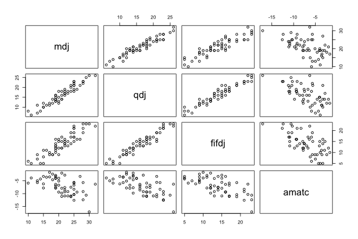
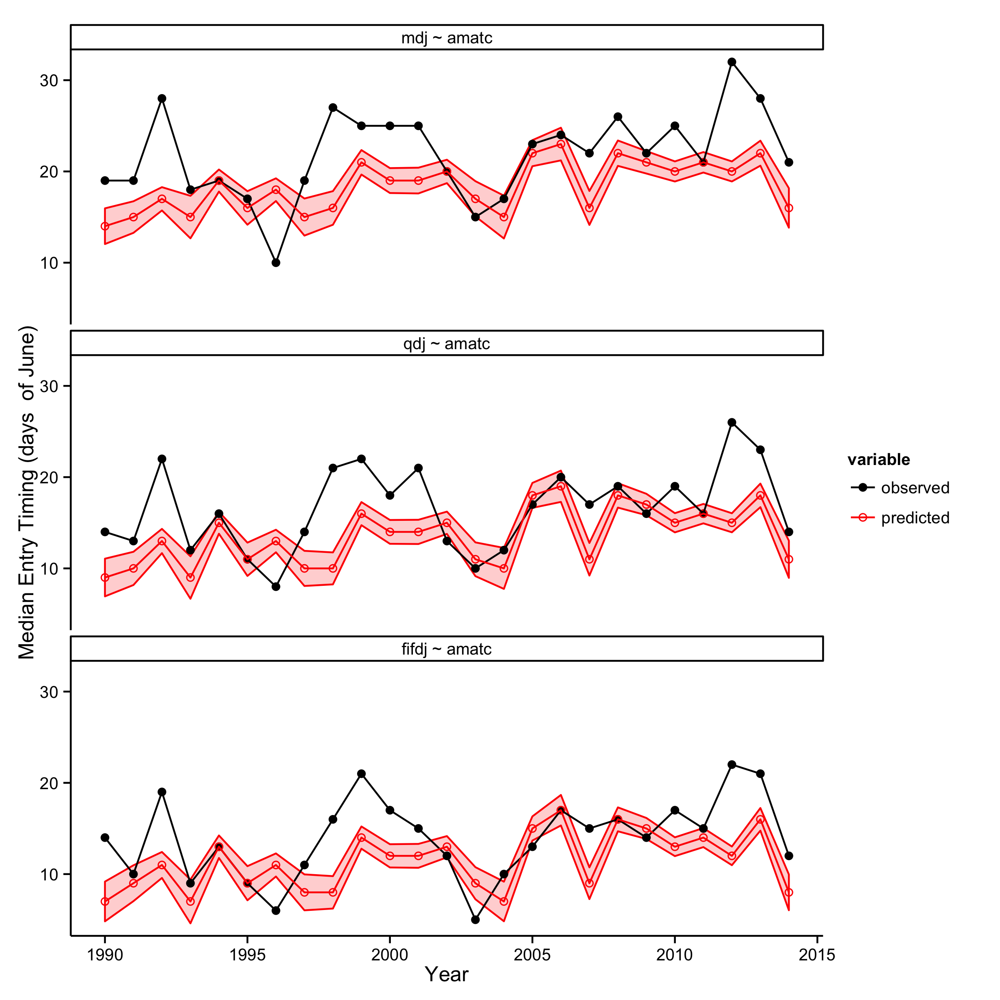
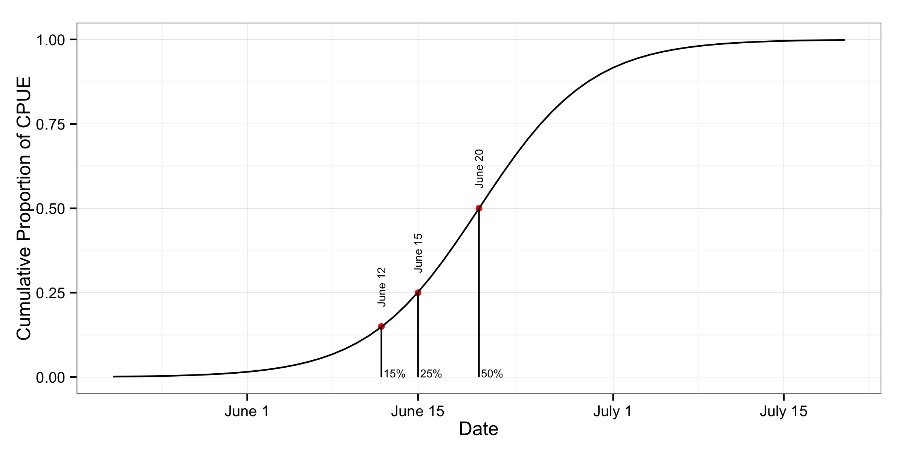

# 2015 April Forecast Writeup

-------   | ------ 
Author    | Bryce Mecum (bdmecum@alaska.edu) 
Written   | 2015-05-03 
Generated | 2015-05-03

## Model & Data

The model used in this analysis was a modified version of the full model from
Mundy & Evenson (2011), where the full model regresses three environmental variables against three percentiles of cumulative catch-per-unit-effort (CPUE) from a time series of D-1 Yukon commercial fishing catch data (1961-1979) and test fishing catches from the Lower Yukon Test Fishery (LYTF, 1980-2014). 

The reduced model was comprised of just one of the three explanatory variables, April meanair temperature at Nome, Alaska (AMATC), and was used to predict the three percentiles of cumulative CPUE. We used this reduced model because AMATC for the current forecast year is available at the end of April while data for the other two variables is not avaialble until the end of May for the current
forecast year.

While the relationship between the three percentiles of cumulative CPUE is better explained by all three environmental variables, managers and interested stakeholders have interest in having a preliminary forecast available earlier than at the end of May, when current-year data for all three environmental variables have been collected. 

Below I've shown a pair scatterplot for the three percentiles and AMATC. 

## Historical performance

To arrive at an estimate of expected out-of-sample forecast error, I used hindcasting to calculate a suite of forecast error metrics. Here, hindcasting refers to the process of making a forecast from a model for year $y$ after the model has been fit to data collected prior to year $y$. The suite of forecast error metrics were (1) mean absolute prediction error (MAPE), (2) the average width of the approximate 95% normal confidence interval for the prediction (INTWIDTH), and the proportion of observations within the prediction interval INTWIDTH (PROPIN).

The years the hindcast was performed over were 1990 - 2014.

Formula          MAPE   INTWIDTH   PROPIN
--------------  -----  ---------  -------
MDJ ~ AMATC      4.32   3.174424     0.32
QDJ ~ AMATC      3.84   3.084550     0.36
FIFDJ ~ AMATC    3.60   3.076177     0.36

## 2015 Forecast

Using a 2015 value for AMATC of -5.88889C, the dates of the three percentiles of CPUE are June 12, 15, and 20 (15%, 25%, 50%). These values were created by fitting the AMATC-only model to all data prior to 2015 and using the corresponding model fit to predict the 2015 date for each cumulative percentile.

